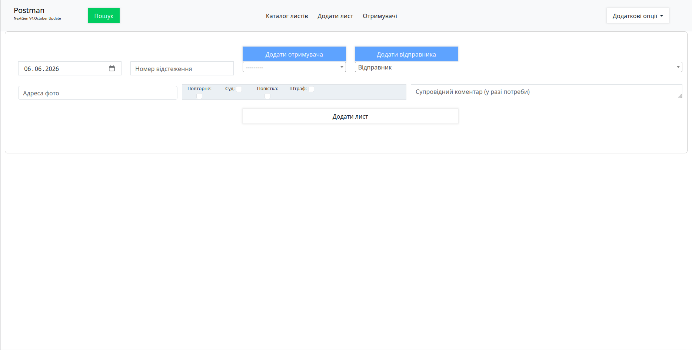
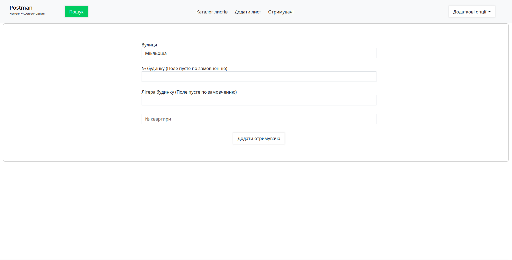

# The Postman (NextGen v4. October update 2023)
A simple CRM system for recording and organising information about packages that come to the Post Office. It was my own internal platform to do my job when I was at postman position.

## Project opportunities
- Creating entries: packages, senders, recipients
- Show list of entries with pagination
- Searching per packages

## Project setup
### Add environment
```
python3 -m venv venv
```

### Install requirements
```
pip install -r requirements.txt
```

### Activate environment
```
source venv/bin/activate 
```

### Migrate models
```
python3 manage.py migrate
```

### Run server
```
python3 manage.py runserver
```

### Page address
```
http://localhost:8000
```

#### Preview images

 

